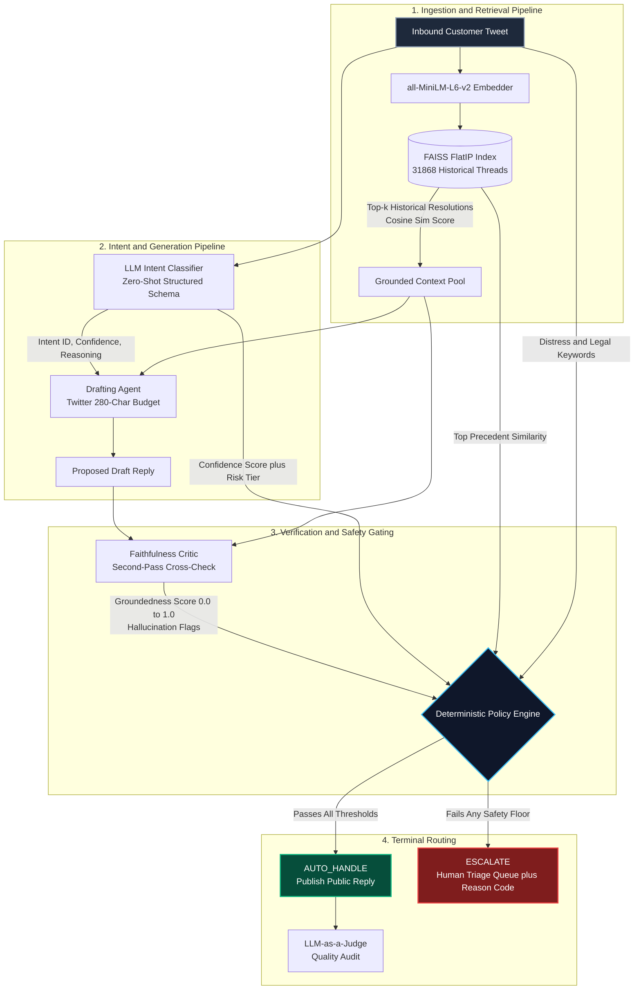
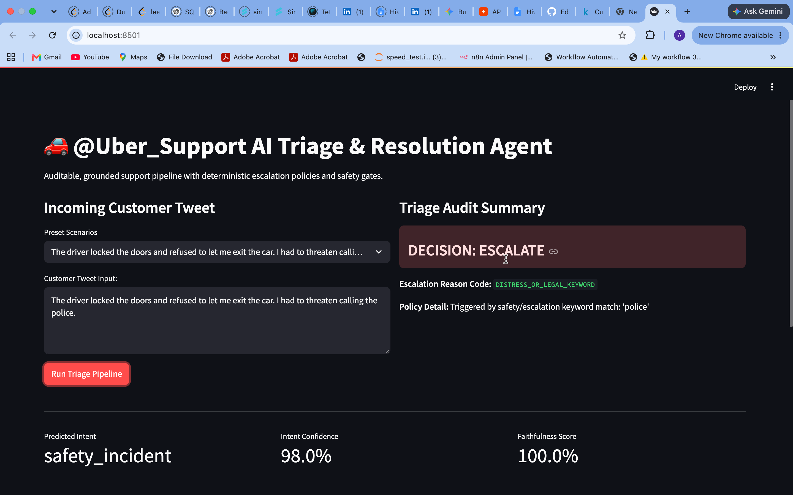
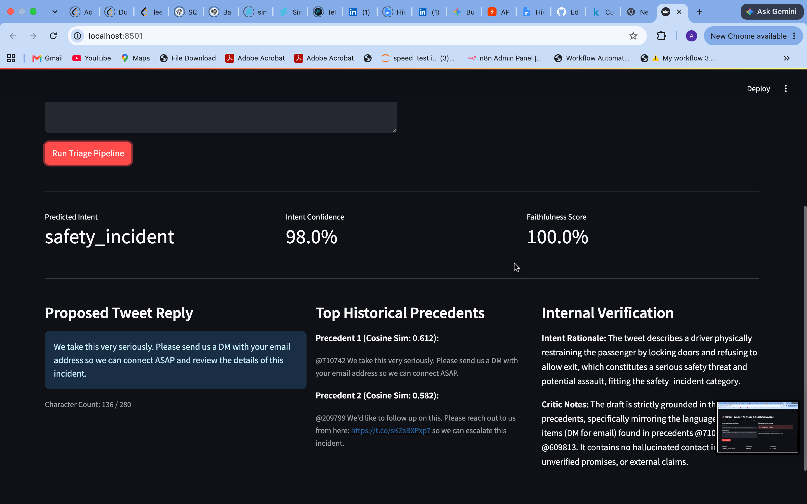

# 🚗 @Uber_Support AI Triage & Resolution Engine

[](https://www.python.org/)
[](https://github.com/facebookresearch/faiss)
[](https://groq.com/)
[](https://streamlit.io/)
[](eval/)

An auditable, retrieval-grounded customer support triage system engineered for **@Uber_Support** on Twitter. The agent classifies multi-intent inquiries, retrieves historical verified resolutions, drafts policy-constrained public replies, audits groundedness via a secondary critic pass, and executes deterministic escalation gates.

---

## 🏛️ System Architecture



---

## ⚙️ Deterministic Policy & Operational Thresholds

To prevent model overconfidence from causing catastrophic safety failures, the agent delegates terminal decisions to a deterministic policy gate:

```
┌─── [Safety / Distress Keyword Triggered?] ─────────► ESCALATE (DISTRESS_OR_LEGAL_KEYWORD)
                  ├─── [Intent Risk Tier == CRITICAL / HIGH?] ─────────► ESCALATE (CRITICAL_SAFETY_INTENT)
Inbound Tweet ───►├─── [Intent Confidence < 0.72?] ───────────────────► ESCALATE (LOW_CLASSIFIER_CONFIDENCE)
                  ├─── [Top Precedent Cosine Similarity < 0.58?] ──────► ESCALATE (NO_HISTORICAL_PRECEDENT)
                  └─── [Faithfulness Critic Score < 0.80?] ────────────► ESCALATE (LOW_GROUNDEDNESS_SCORE)
                                  │
                                  ▼ (Passed All Gates)
                              AUTO_HANDLE
```

---

## 🖼️ Demo Screenshots

<p align="center">
  
  <br/>
  <em>Screenshot 1: Interactive audit & inspection interface</em>
</p>

<p align="center">
  
  <br/>
  <em>Screenshot 2: Escalation decision trace with reason codes</em>
</p>

---

## 📂 Project Directory Structure

```
hiver-support-agent/
├── README.md                          # Quickstart, architecture, and reproducibility guide
├── report.md                          # Comprehensive 6-page technical report
├── decision_log.md                    # Auditable log of key architectural decisions
├── config.yaml                        # System thresholds, model endpoints, and parameters
├── requirements.txt                   # Production dependencies
├── Makefile                           # Unified automation tasks
├── docs/
│   └── screenshots/                   # Demo screenshots referenced in this README
│       ├── demo-1.png
│       └── demo-2.png
├── data/
│   ├── processed/                     # Thread-reconstructed dialogues & FAISS index
│   │   ├── uber_subset.csv
│   │   ├── uber_threads.parquet
│   │   ├── faiss_index.bin
│   │   └── index_metadata.parquet
│   └── golden/                        # Hand-labeled golden test set
│       ├── golden_set.csv
│       └── labeling_notes.md
├── src/
│   ├── ingest/                        # Dataset filtering & multi-turn thread reconstruction
│   │   ├── filter_brand.py
│   │   └── thread_builder.py
│   ├── intents/                       # Unsupervised cluster mining & domain taxonomy
│   │   ├── cluster_explore.py
│   │   └── taxonomy.yaml
│   ├── retrieval/                     # Dense vector search engine
│   │   ├── build_index.py
│   │   └── retriever.py
│   ├── classify/                      # Baseline models & primary structured classifier
│   │   ├── baseline_tfidf.py
│   │   └── llm_classifier.py
│   ├── generate/                      # Retrieval-conditioned generation & audit critic
│   │   ├── draft_reply.py
│   │   └── faithfulness_critic.py
│   ├── policy/                        # Policy-as-code deterministic escalation logic
│   │   └── escalation_policy.py
│   └── pipeline.py                    # End-to-end unified inference pipeline
├── eval/
│   ├── build_golden_sample.py         # Stratified golden set sampler
│   ├── annotate_golden.py             # Domain rule annotation engine
│   ├── llm_judge.py                   # Impartial QA judge rubric
│   ├── judge_human_agreement.py       # Cohen's Kappa calibration suite
│   └── run_eval.py                    # Full pipeline evaluation harness
└── app/
    └── streamlit_demo.py              # Interactive audit & inspection interface
```

---

## 🚀 Quickstart (< 10 Minutes Reproduction)

### 1. Clone & Set Up Environment
```bash
git clone https://github.com/AdityaRajput8/hiver-support-agent
cd hiver-support-agent

python3 -m venv venv
source venv/bin/activate
pip install -r requirements.txt
```

### 2. Configure API Credentials
Create a `.env` file in the project root:
```
GROQ_API_KEY=gsk_your_api_key_here
```

### 3. Run Baselines & Evaluation Suite
```bash
# Run baseline classifiers (Majority Class & TF-IDF + Logistic Regression)
python src/classify/baseline_tfidf.py

# Run the end-to-end evaluation harness on the golden set
python eval/run_eval.py

# Run judge-human calibration check
python eval/judge_human_agreement.py
```

### 4. Launch Interactive Audit UI
```bash
streamlit run app/streamlit_demo.py --server.fileWatcherType=none
```

---

## 🔍 Core Differentiators

- **Groundedness as a First-Class Metric:** Replies are not generated from parametric memory alone. The agent retrieves verified resolutions from @Uber_Support, conditions drafting on them, and scores faithfulness with a secondary auditor pass before publication.
- **Auditable Policy-as-Code:** Escalation is never delegated to subjective LLM confidence. Decisions run through an explicit Python rule engine with fixed error codes (`NO_HISTORICAL_PRECEDENT`, `CRITICAL_SAFETY_INTENT`, `LOW_GROUNDEDNESS_SCORE`).
- **Defense-in-Depth Risk Management:** Physical safety and driver conduct complaints are hard-coded to escalate by design, ensuring zero autonomous deflection on severe incidents.
- **Honest Metric Accounting:** The mandatory report section "What is Misleading About My Headline Number?" dissects majority-class skew and evaluation sample dynamics.

---

## 📸 How to Attach Demo Screenshots

Follow these steps to add your two demo screenshots so they render correctly in this README:

1. **Create a screenshots folder** in your repo (matches the structure above):
   ```bash
   mkdir -p docs/screenshots
   ```
2. **Copy your two screenshot files** into that folder and name them to match the README references (or rename the references above to match your files):
   ```bash
   cp /path/to/your/first-screenshot.png docs/screenshots/demo-1.png
   cp /path/to/your/second-screenshot.png docs/screenshots/demo-2.png
   ```
3. **Stage, commit, and push** the new files to GitHub:
   ```bash
   git add docs/screenshots/demo-1.png docs/screenshots/demo-2.png README.md
   git commit -m "Add demo screenshots"
   git push origin main
   ```
4. **Verify rendering** — open the README on GitHub (`github.com/AdityaRajput8/hiver-support-agent`) and confirm both images load under the "Demo Screenshots" section. If an image doesn't show, double-check the filename and path exactly match what's in the `` tag (GitHub paths are case-sensitive).

**Alternative (no local git needed):** On GitHub.com, open your repo → click **Add file → Upload files** → drag in your two screenshots → set the target path to `docs/screenshots/` → commit directly to `main`. The README's `` tags will pick them up automatically once the paths match.